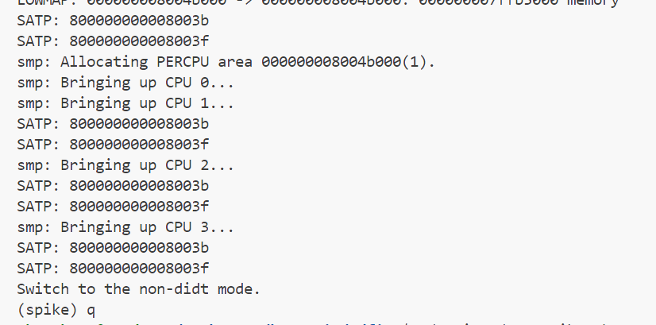

6.26
尝试学习sdfirm源码
由于未找到系统自带的spike等工具，git clone搞了半天
用自带的spike跑testbench，卡在

用spike跑hello.c，安装pk，参数为--prefix=$CROSSCOMPILE(CROSSCOM_COMPILE被sdfirm prerequisite占用) --host=riscv64-unknown-linux-gnu
pk使用需要全路径(暂未解决)
spike pk hello 没有反应，ctrl+c出现(spike):命令行